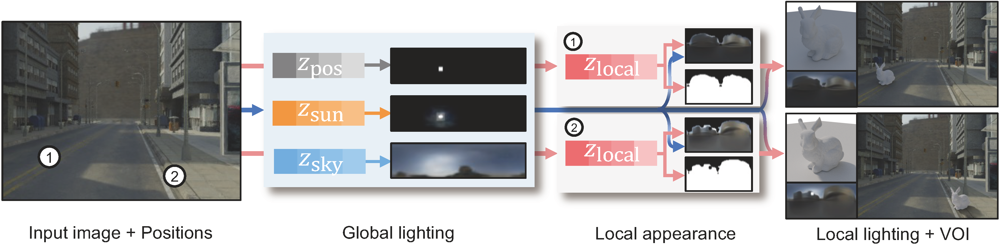
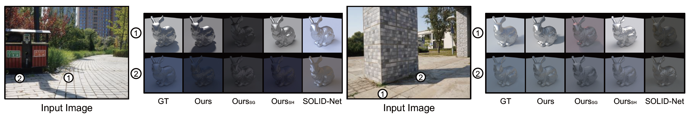
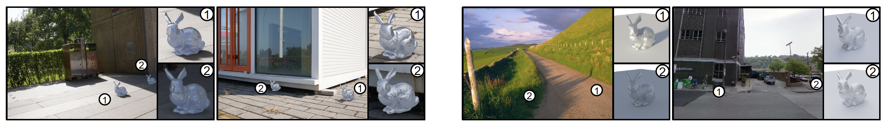
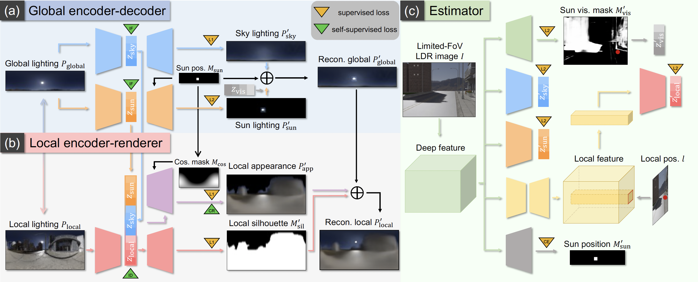

# SOLD-Net
## Introduction

This repo contains the code and data for ***S**patially-varying **O**utdoor **L**ighting estimation with **D**isentangled representation* (ECCV 2022 paper) [[Paper](https://ci.idm.pku.edu.cn/Tang_ECCV22a.pdf)].

Our pipeline takes a single limited-FoV LDR image and marked pixel positions as input, and estimates the global lighting of the image and the local lightings of all marked pixel positions, which is useful for applications such as virtual object insertion (VOI).




## Code



The code is arranged in the following way:

`<CODEROOT>/encoding` contains the code for the *global lighting encoder-decoder* and *local content encoder-renderer*.

`<CODEROOT>/estimating` contains the code for the *spatially-varying lighting estimator*.

`<CODEROOT>/relighting` contains the code for generating and evaluating the relighting results.

### Environment

We use `python 3.9.7` and `pytorch 1.8` for our code, the other dependencies are listed in the `<CODEROOT>/requirements.txt` file.

### Pretrained models

Please download the pretrained model from the following link:

**Pretrained Models:** [[Baidu Netdisk](https://pan.baidu.com/s/1-5NqI2S3Vt6J-4antMCPCg)] (Password: `i6ef`, 216 MB in total)

## Data

Here is the data used in the paper:

### Laval Sky HDR database

To learn the encoding of the global lighting, we use the Laval Sky HDR database as training data, the database can be downloaded from their [official website](http://sky.hdrdb.com).

### Synthetic data

The synthetic data contains images and labels rendered from [synthetic city 3D models](http://www.cgchan.com) enhanced with PBR textures from [ambientCG](https://ambientcg.com) and unclipped HDR environment maps collected from [Poly Haven](https://polyhaven.com) as the global lighting.

The dataset is arranged in the following way:

`<DATAROOT>/perspective` contains 320*240 limited-FoV LDR images rendered from the above settings.

<!-- `<DATAROOT>/intrinsic` contains 320*240 intrinsic labels of the limited-FoV LDR images. -->

`<DATAROOT>/sun_invisible_mask` contains hand-crafted precomputed 320*240 pixel-wise pseduo-labels of sun visibility.

`<DATAROOT>/global_lighting` contains 128*32 panoramic global lighting maps of the limited-FoV LDR images.


`<DATAROOT>/global_lighting_code` contains the encoded sun, sky information from global lighting maps using the trained global lighting encoder.

`<DATAROOT>/local_cameras` contains 4 marked pixel positions for each limited-FoV LDR image where the local lighting maps are rendered.

`<DATAROOT>/local_pano` contains 128*64 panoramic local lighting maps captured by a virtual camera placed at the marked pixel positions.

`<DATAROOT>/local_lighting_code` contains the encoded local content from local lighting maps using the trained local content encoder.

```
|-- <DATAROOT>
|   |-- perspective
|   |   |-- <CITYCAM1>/rendered
|   |   |   |-- <ENVNAME1>
|   |   |   |   |-- azimuth_<ROT>.npy
|   |   |   |   |-- image_<ROT>.hdr
|   |   |   |   |-- image_<ROT>.png
|   |   |   |-- ...
|   |   |-- ...
|   |-- sun_invisible_mask
|   |   |-- <CITYCAM1>/rendered
|   |   |   |-- <ENVNAME1>
|   |   |   |   |-- shadow_sub_raw_<ROT>.exr
|   |   |   |   |-- sun_invisible_mask_<ROT>.png
|   |   |   |-- ...
|   |   |-- ...
|   |-- global_lighting
|   |   |-- <CITYCAM1>/rendered
|   |   |   |-- <ENVNAME1>
|   |   |   |   |-- global_lighting_<ROT>.hdr
|   |   |   |   |-- sun_pos_<ROT>.pkl
|   |   |   |   |-- sun_pos_mask_<ROT>.png
|   |   |   |-- ...
|   |   |-- ...
|   |-- global_lighting_code
|   |   |-- all_dump.pkl
|   |   |-- <CITYCAM1>/rendered
|   |   |   |-- <ENVNAME1>
|   |   |   |   |-- sky_code_<ROT>.npy
|   |   |   |   |-- sun_code_<ROT>.npy
|   |   |   |-- ...
|   |   |-- ...
|   |-- local_cameras
|   |   |-- <CITYCAM1>/local_samples
|   |   |   |-- <ENVNAME1>
|   |   |   |   |-- image_<ROT>_local.npy
|   |   |   |-- ...
|   |   |-- ...
|   |-- local_pano
|   |   |-- <CITYCAM1>/rendered
|   |   |   |-- <ENVNAME1>
|   |   |   |   |-- angle_<ROT>_camera_<LOCAL>_mask.png
|   |   |   |   |-- angle_<ROT>_camera_<LOCAL>.hdr
|   |   |   |-- ...
|   |   |-- ...
|   |-- local_lighting_code
|   |   |-- all_dump.pkl
|   |   |-- <CITYCAM1>/rendered
|   |   |   |-- <ENVNAME1>
|   |   |   |   |-- angle_<ROT>_local_code_<LOCAL>.npy
|   |   |   |-- ...
|   |   |-- ...
|   |-- split
|   |   |-- train.txt
|   |   |-- test.txt
```

where `<DATAROOT>` is the root directory of the synthetic dataset, `<CITYCAMx>` is the name of the city and camera, `<ENVNAMEx>` is the name of the global lighting environment map, `<ROT>` indicates different rotation augmentation of global lighting (from 0 to 5), and `<LOCAL>` is the numbering of local lighting for each limited-FoV image (from 0 to 3).

**Note:** this arrangement implicitly indicates the paired data with the same local content but different global lighting, if you want to use your own data, please arrange your data in the same way or disable the local identity loss and cross-render loss.

The dataset can be downloaded from the following link:

**Test set:** [[Baidu Netdisk](https://pan.baidu.com/s/1YX5i0Jb07pymAA629lKX3A)] (Password: tfdz, 953 MB in total)

**Train set:** [[Baidu Netdisk](https://pan.baidu.com/s/163eFAbD8Zyb-tU1mypMOyQ)] (Password: esh6, 66 GB in total)

### Real data

We captured the first real-world lighting dataset with unclipped HDR local lighting labels.

The dataset is arranged in the following way:
```
|-- <DATAROOT>
|   |-- <XXX>_persp.jpg
|   |-- <XXX>_local.npy
|   |-- <XXX>_local_0.hdr
|   |-- <XXX>_local_1.hdr
|   |-- <XXX>_sun_pos.txt
|   |-- ...
```

where `<DATAROOT>` is the root directory of the real dataset, `<XXX>` is the numbering from 001 to 020, the `<XXX>_persp.jpg` is the limited-FoV  LDR image of the real-world scene, the `<XXX>_local.npy` is the marked pixel position in the limited-FoV image corresponding to the captured HDR local lighting maps `<XXX>_local_0.hdr` and `<XXX>_local_0.hdr`, and `<XXX>_sun_pos.txt` contains the label of sun position.

The dataset can be downloaded from the following link:

**Real data:** [[Baidu Netdisk](https://pan.baidu.com/s/1UquxZ4MGzxQqlnxm1CX1XA)] (Password: `svqa`, 1.3 MB in total)

## Evaluation

### Global and local lighting estimation

To test on the synthetic data, run the following command:
```
python <CODEROOT>/estimating/estimator_test.py --load_estimator_path ../pretrained_model/estimator_b16_para.pth --batch_size 16 --result_dir ./result/synthetic --log_image --log_mu 16 --postprocess_mask
```

To test on the real data, run the following command:
```
python <CODEROOT>/estimating/estimator_test_real.py --load_estimator_path ../pretrained_model/estimator_b16_para.pth --batch_size 16 --result_dir ./result/real --log_image --log_mu 16 --postprocess_mask
```

### Global and local lighting encoding

To test on the global lighting encoding, run the following command:
```
python <CODEROOT>/encoding/global_test.py --load_sky_enc_path ../pretrained_model/enc_sky_log_ft_distort_info.pth --load_sun_enc_path ../pretrained_model/enc_sun_log_ft_distort_info.pth --load_sky_dec_path ../pretrained_model/dec_sky_log_ft_distort_info.pth --load_sun_dec_path ../pretrained_model/dec_sun_log_ft_distort_info.pth --batch_size 16 --plot_every 1 --result_dir ./result/global/ --log_image --log_mu 16 --sun_dim 45 --sky_dim 16 --dataset synthetic --model_activ relu
```

To test on the local lighting encoding, run the following command:
```
python <CODEROOT>/encoding/local_test.py --load_sky_enc_path ../pretrained_model/enc_sky_log_ft_distort_info.pth --load_app_dec_path ../pretrained_model/dec_app_split_log_identity_cross_rot_distort.pth --load_sil_dec_path ../pretrained_model/dec_sil_split_log_identity_cross_rot_distort.pth --load_sky_enc_path ../pretrained_model/enc_sky_log_ft_distort_info.pth --load_sun_enc_path ../pretrained_model/enc_sun_log_ft_distort_info.pth --load_local_enc_path ../pretrained_model/enc_local_split_log_identity_cross_rot_distort.pth --load_sky_dec_path ../pretrained_model/dec_sky_log_ft_distort_info.pth --load_sun_dec_path ../pretrained_model/dec_sun_log_ft_distort_info.pth --batch_size 16 --result_dir ./result/local --log_image --log_mu 16
```

### Relighting

Here we provide code for generating and evaluating the relighting results using predicted/ground truth lighting maps, go to `<CODEROOT>/relighting` for more details.

### Lighting disentanglement

The global lighting and local lighting are represented in disentangled spaces of sun position, sun lighting, sky lighting and local content. We can combine the disentangled parts encoded from different lighting maps and cross-render a new lighting map.

To cross-render global lighting maps with different sun positions, run the following command:

```
python <CODEROOT>/encoding/global_editing.py --edit sun_pos --load_sky_enc_path ../pretrained_model/enc_sky_log_ft_distort_info.pth --load_sun_enc_path ../pretrained_model/enc_sun_log_ft_distort_info.pth --load_sky_dec_path ../pretrained_model/dec_sky_log_ft_distort_info.pth --load_sun_dec_path ../pretrained_model/dec_sun_log_ft_distort_info.pth --batch_size 16 --result_dir ./result/global_editing/ --log_image --log_mu 16 --sun_dim 45 --sky_dim 16 --dataset synthetic
```

To cross-render global lighting maps with different sun lighting, run the following command:

```
python <CODEROOT>/encoding/global_editing.py --edit sun_info --load_sky_enc_path ../pretrained_model/enc_sky_log_ft_distort_info.pth --load_sun_enc_path ../pretrained_model/enc_sun_log_ft_distort_info.pth --load_sky_dec_path ../pretrained_model/dec_sky_log_ft_distort_info.pth --load_sun_dec_path ../pretrained_model/dec_sun_log_ft_distort_info.pth --batch_size 16 --result_dir ./result/global_editing/ --log_image --log_mu 16 --sun_dim 45 --sky_dim 16 --dataset synthetic
```

To cross-render global lighting maps with different sky lighting, run the following command:

```
python <CODEROOT>/encoding/global_editing.py --edit sky_info --load_sky_enc_path ../pretrained_model/enc_sky_log_ft_distort_info.pth --load_sun_enc_path ../pretrained_model/enc_sun_log_ft_distort_info.pth --load_sky_dec_path ../pretrained_model/dec_sky_log_ft_distort_info.pth --load_sun_dec_path ../pretrained_model/dec_sun_log_ft_distort_info.pth --batch_size 16 --result_dir ./result/global_editing/ --log_image --log_mu 16 --sun_dim 45 --sky_dim 16 --dataset synthetic
```

To cross-render local lighting maps with different global lighting and local content, run the following command:

```
python <CODEROOT>/encoding/local_editing.py --load_sky_enc_path ../pretrained_model/enc_sky_log_ft_distort_info.pth --load_app_dec_path ../pretrained_model/dec_app_split_log_identity_cross_rot_distort.pth --load_sil_dec_path ../pretrained_model/dec_sil_split_log_identity_cross_rot_distort.pth --load_sky_enc_path ../pretrained_model/enc_sky_log_ft_distort_info.pth --load_sun_enc_path ../pretrained_model/enc_sun_log_ft_distort_info.pth --load_local_enc_path ../pretrained_model/enc_local_split_log_identity_cross_rot_distort.pth --load_sky_dec_path ../pretrained_model/dec_sky_log_ft_distort_info.pth --load_sun_dec_path ../pretrained_model/dec_sun_log_ft_distort_info.pth --batch_size 16 --result_dir ./result/local_editing --log_image --log_mu 16 
```

### Ablation study

To run ablation study of the local content encoder and local appearance renderer, run the following command with `--cosine_random`, `--cosine_zero` or `--cross_render`:

```
python <CODEROOT>/encoding/local_test_appearance.py  --load_sky_enc_path ../pretrained_model/enc_sky_log_ft_distort_info.pth --load_app_dec_path ../pretrained_model/dec_app_split_log_identity_cross_rot_distort.pth --load_sil_dec_path ../pretrained_model/dec_sil_split_log_identity_cross_rot_distort.pth --load_sky_enc_path ../pretrained_model/enc_sky_log_ft_distort_info.pth --load_sun_enc_path ../pretrained_model/enc_sun_log_ft_distort_info.pth --load_local_enc_path ../pretrained_model/enc_local_split_log_identity_cross_rot_distort.pth --load_sky_dec_path ../pretrained_model/dec_sky_log_ft_distort_info.pth --load_sun_dec_path ../pretrained_model/dec_sun_log_ft_distort_info.pth --batch_size 16 --result_dir ./result/local_ablation --log_image --log_mu 16
```

## Training

To train the full pipeline from the scratch, do the following steps (here we give the example parameter settings):

1. Download the Laval Sky HDR database (or other alternatives) and train the global lighting encoder-decoder:

```
python <CODEROOT>/encoding/global_train.py --dataset mixed --radiometric_distorsion --radiometric_distorsion_prob 0.5 --info_loss --info_loss_type L2 --info_loss_sky_coeff 0.1 --info_loss_sun_coeff 0.1 --log_image --log_mu 16 --model_activ relu --sky_dim 16 --sun_dim 45 --num_epoch 70 --batch_size 16 --lr 2e-4 --lr_multistep_schedule 20 40 60 70 80 90 100 --lr_multistep_gamma 0.5 --l1_coeff 10.0 --l2_coeff 1.0 --tmo_log_exposure -1 --save_every 1 --plot_every 10 --eval_every 1 --save_dir ./tasks/global --num_loader 8
```

2. Using the trained global encoder to extract sky lighting codes and sun lighting codes from the global lighting map:

```
python <CODEROOT>/encoding/global_encode.py --log_image --log_mu 16 --model_activ relu --sky_dim 16 --sun_dim 45 --batch_size 16
```

3. Using the extracted global lighting codes and corresponding local lighting maps to train the local lighting encoder-decoder:

```
python <CODEROOT>/encoding/local_train.py --num_epoch 20 --rotation_distorsion --rotation_distorsion_prob 0.8 --radiometric_distorsion --radiometric_distorsion_prob 0.5 --batch_size 16 --lr 2e-4 --lr_multistep_schedule 2 4 6 8 10 --lr_multistep_gamma 0.5 --l1_coeff 1.0 --l2_coeff 1.0 --l1_sil_coeff 0.05 --l2_sil_coeff 0.05 --identity_loss --identity_loss_type L2 --identity_loss_coeff 0.1 --cross_render_loss --cross_render_l1_coeff 0.5 --cross_render_l2_coeff 0.5 --log_image --log_mu 16 --sky_dim 16 --sun_dim 45 --model_activ relu --save_every 1 --plot_every 100 --eval_every 1 --tmo_log_exposure 0
```

4. Using the trained local encoder to extract local content codes from the local lighting maps:

```
python <CODEROOT>/encoding/local_encode.py --log_image --log_mu 16 --batch_size 16 --model_activ relu
```

5. Using the extracted disentangled lighting codes as training targets to train the spatially-varying lighting estimator:

```
python <CODEROOT>/estimating/estimator_train.py --log_image --log_mu 16 --multi_gpu --gpu_list 0 1 2 3 --batch_size 16 --tmo_log_exposure 0 --num_epoch 30 --lr 4e-4 --lr_multistep_schedule 12 14 16 20 --lr_multistep_gamma 0.5 --mask_mse_coeff 2.0 --pos_bce_coeff 10.0 --sky_code_mse_coeff 1.0 --sun_code_mse_coeff 2.0 --local_code_mse_coeff 1.0 --sky_mae_coeff 0.5 --sun_mae_coeff 0.5 --local_app_mae_coeff 2.0 --local_sil_mse_coeff 0.5 --save_every 1 --save_every_iter 2000 --plot_every_iter 10 --tb_save_image_every 25 --eval_every 1 --eval_every_iter 2000
```

## Citation
If you find this paper useful to your research, please cite our papers: [Estimating spatially-varying lighting in urban scenes with disentangled representation](https://ci.idm.pku.edu.cn/Tang_ECCV22a.pdf).

```
@InProceedings{SOLD-Net,
  author = {Tang, Jiajun and Zhu, Yongjie and Wang, Haoyu and Chan, Jun-Hoong and Li, Si and Shi, Boxin},
  title = {Estimating spatially-varying lighting in urban scenes with disentangled representation},
  booktitle = {{ECCV}},
  year = {2022}
}
```